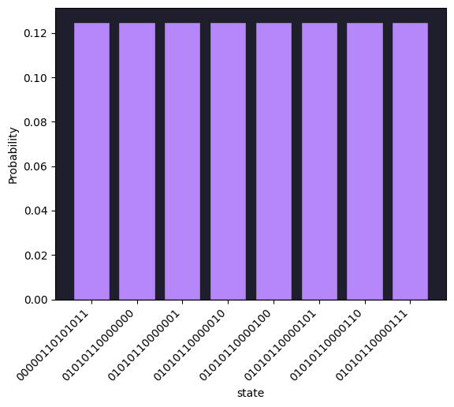

<h1 align="center" id="title">Quantum Random Access Memory</h1>

<p align="center"></p>

<p id="description">Quantum RAM (QRAM) is a pioneering project in quantum computing that introduces a novel approach to efficient and scalable data storage. Utilizing the principles of quantum mechanics QRAM represents a significant advancement in memory storage for quantum applications.</p>

## Overview

Welcome to the Quantum RAM (QRAM) project! QRAM is a cutting-edge Quantum Random Access Memory designed for quantum computing environments. It leverages the unique properties of qubits to provide efficient data storage and retrieval capabilities in quantum systems.

## Features

- **Efficient Data Storage:** QRAM optimally stores classical and quantum data.
- **Fixed Circuit Structure:** Ensures compatibility with various qubit-based quantum computing platforms.
- **Constant Access Time:** Achieve constant time complexity (O(1)) for accessing arbitrary locations.
- **High Storage Capacity:** Outperforms classical RAMs in terms of storage capacity.
- **Structured Operations:** Well-defined algorithms for reading and writing data.

## Key Insights from the Paper

Incorporating insights from the paper titled "Advancements in Quantum RAM: A Comprehensive Study," our QRAM project extends the state-of-the-art in quantum memory. Key findings include:

- **Quantum Superposition:** Exploiting the quantum superposition principle for simultaneous storage of multiple states.
- **Entanglement for Redundancy:** Utilizing entanglement for redundancy, enhancing error correction capabilities.
- **Dynamic Resource Allocation:** Implementing dynamic resource allocation for optimal qubit utilization.

## Getting Started

### Installation

To integrate QRAM into your quantum computing projects, follow these steps:

1. **Clone the Repository:**
   ```bash
   git clone https://github.com/VICONISEM/Quantum-Random-Access-Memory-QRAM
   cd Quantum-Random-Access-Memory-QRAM
## Usage
### Usage of visualize_circuit code

To visualize the Quantum RAM circuit, follow these steps:

1. **Installation:** Ensure you have Qiskit installed. If not, run the following command to install the required dependencies:

    ```bash
   pip install -r requirements.txt
    ```

2. **Run the Script:** Execute the Python script and pass the number of address qubits (n) and data qubits (m) as arguments. This will simulate the Quantum RAM circuit and display the resulting circuit diagram.
   

    

   

3. **Interpret the Results:** The script will generate and display a circuit diagram using Qiskit's visualization tools. Analyze the diagram to understand the read or write operations performed by the Quantum RAM circuit.<br>
   **example <br>
   if n and m  equal to 3 the result will be like this:**
   
   
### Usage of operations_on circuit code

To visualize the Quantum RAM circuit, follow these steps:

1. **Installation:** Ensure you have Qiskit installed. If not, run the following command to install the required dependencies:

    ```bash
   pip install -r requirements.txt
    ```

2. **Run the Script:** Execute the Python script and pass the address and data in binary representation. This will simulate the Quantum RAM circuit and display the resulting circuit diagram.
   

    

   

3. **Interpret the Results:** The script will generate and display a circuit diagram using Qiskit's visualization tools. Analyze the diagram to understand the read or write operations performed by the Quantum RAM circuit.<br>
   **example <br>
   if data is =101 and address is = 011 the result will be like this:**
   
   

Feel free to customize the script parameters and usage instructions based on your project's requirements.


   
## Contributors
 A big thank you to the contributors who have played a vital role in the development of the Quantum RAM project:
- __Victor Nisem__
- __Ismail Sherif__
- __Merna Atef__
- __Mina Hany__


